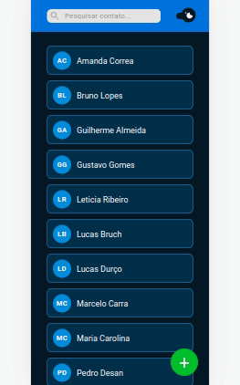
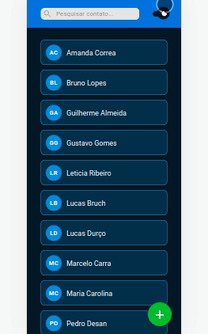

## Contacts 📘

</br>

<p align="center">
  
   
</p>

</br>

## About ❔

Contacts is a web application for you to save all your most important contacts in a user-friendly layout. 😃

<!-- ## Preview

um gif da aplicação bem maneiro -->

</br>

## Deployment 🚀

<p align="center"><a  href="https://contacts-mocha.vercel.app/">https://contacts-mocha.vercel.app/</a></p>

</br>

## Features ✅

- [x] create contact
- [x] show a list of contacts
- [x] edit contact
- [x] delete contact
- [x] toggle web app theme colors

</br>

## How to run 🏃‍♀️💨

```bash
# Clone the API repository
$ git clone <https://github.com/victordurco/contacts-api>

# Access the API project folder cmd/terminal
$ cd contacts-api

# Install the dependencies
$ npm install

# Follow de instructions in the API repository to start dev server
https://github.com/victordurco/contacts-api

# Clone this repository in another folder
$ git clone <https://github.com/victordurco/contacts>

# Access the project folder cmd/terminal
$ cd contacts

# Install the dependencies
$ npm install

# Compile the code
$ npm run build

# Run the application
$ npm run start

# The server will automatically start at localhost:3000/ on your favorite browser
```

</br>

## Tech Stack 💾

<br/>

<p align="center">


</p>

</br>

<!--
### Contributors and Contact

### Acknowledgements -->
